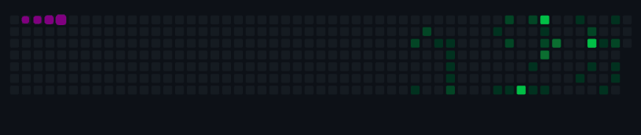

 

 
<h1 align="left" style="margin-bottom: 0;">Matheus Wachtler 
</h1>
  <!--    -->

  
  
  

<h1 align="left">"Hi folks, how are you doing ?</h1>

 

My name is Matheus. I'm 28 years old, and I live in São Paulo with my wife and two cats.

I graduated in Systems Analysis and Development, and I am passionate about programming.

Research-oriented, I am always looking for ways to improve my results.

 

<h1 align="left"> Technologies </h1>

 

<code></code>
<code></code>
<code></code>
<code></code>
<code></code>
<code></code>
<code></code>
<code> </code>

 

<h1 align="left"> About Me </h1>

 

 
 💻 Currently, I am working as a Sr QA Engineer at Avanade. 

 
 📚 Proficiency in JAVA and other testing frameworks such as Selenium, JUnit, Cucumber, and Rest-Assured. 

 
 😬 According to the results of some research, I have a choleric temperament. Therefore, I enjoy taking the lead and never lose sight of my goals. 

 
 ✈️ Speaking of goals, my biggest dream is to one day work and live in another country. 

 
 🎮 In my free time, I'm an enthusiast of video games, and I also enjoy playing the guitar. 

 
 ⛪ I am a Christian, and I recently married the most beautiful woman in the world ❤️. 

